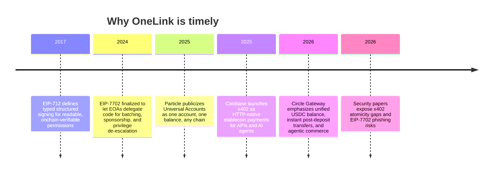

# OneLink Pay Research Report

## Executive Summary

- The most credible winning strategy is **not** to broaden OneLink Pay into a generic “cross-chain payments app,” but to sharpen it into a single memorable thesis: **bounded payments for merchants and AI agents, enforced on-chain, with chain abstraction hidden from the user**. That story aligns directly with the brief’s weighting toward consumer UX, Universal Accounts plus EIP-7702 depth, and adoption potential. It also maps unusually well to the design goals explicitly called out in EIP-7702, including batching, sponsorship, and especially *privilege de-escalation* for limited permissions. fileciteturn0file0 citeturn3view0turn9view0

- The single best live-demo “wow” moment is: **a user signs a clear $3 mandate for a merchant or agent; one in-policy charge succeeds cross-chain; a second over-cap charge is blocked before funds move; a public receipt proves what happened on-chain**. In one sequence, that demonstrates consumer safety, EIP-712 clarity, EIP-7702 mastery, chain abstraction, and AI-agent relevance. fileciteturn0file0 citeturn18view1turn28view0turn29view3

- The highest-leverage UX upgrade is a **human-readable “Mandate Card”** shown before signing, with plain-English fields for merchant, per-charge cap, daily cap, total cap, expiry, revoke control, and destination chain. This is not cosmetic; MetaMask’s guidance explicitly says the typed-data names and domain fields are part of the user-facing security interface, and EIP-712 exists precisely to make structured messages understandable and verifiable. citeturn28view0turn29view1turn29view3

- The strongest “deep Particle usage” move is to make **cross-chain sourcing visible**, not just functional. Particle positions Universal Accounts as one account plus one balance across chains, automatic routing, EIP-7702 in-place upgrades, and low-lift chain-agnostic UX. Their own docs also show favorable latency versus alternatives on common routes. You should surface that with route chips, balance provenance, and a delegation-status badge. citeturn11view0turn12view0turn12view1turn13view0

- For sponsor-prize strategy, **Particle + Magic + Arbitrum** are the best primary angles; **Circle** is worth treating as an optional sidecar, not the main judged path. Circle Gateway is compelling because it offers a unified USDC balance and <500 ms transfers *after balance establishment*, but Base and Arbitrum deposits into Gateway still require roughly 13–19 minutes of confirmations, which makes it a weaker primary live-demo rail than your existing Particle-based path. citeturn16view0turn30view0turn9view1turn27view1

- The best immediate beachhead is **AI-agent commerce / programmatic usage-based billing**, with **B2B pay-per-call APIs** as the most credible buyer story right behind it. x402 is explicitly targeted at AI agents, pay-per-request APIs, and machine-to-machine commerce, and Circle Gateway now explicitly markets “agentic commerce” and nanopayments. That means OneLink’s current build is already pointed at a real, fast-moving wedge. citeturn18view1turn16view0turn26view0

- The largest demo risk is not concept risk; it is **reliability risk** from a beta-pinned Particle stack plus EIP-7702 delegation and cross-chain operations in a live setting. Particle’s docs currently warn that Universal Accounts are upgrading to V2 and require account-system changes and fund withdrawal from old accounts. The right response is pre-delegation, cached readiness checks, deterministic fallback receipts, and aggressive observability—not broader scope. fileciteturn0file0 citeturn11view0turn12view1

- The most important integrity move is to lean into honest precision: **this is x402-pattern, not the Coinbase facilitator flow; the “agent” is agent-initiated over a real on-chain firewall; “zero gas” means blocked attempts are stopped in simulation before broadcast**. That framing is still strong, and it will increase judge trust rather than weaken the story. fileciteturn0file0 citeturn18view1turn31view2

## Assumptions and Topic Selection

The prompt says the user’s research topic is unspecified, but the uploaded brief clearly defines a concrete intended topic: **how to upgrade, extend, optimize, and position OneLink Pay to win Particle Network’s UXmaxx hackathon without violating the project’s constraints**. I therefore treat the brief as the operative specification for the research target. fileciteturn0file0

| Plausible topic | Why it is plausible | Broad usefulness |
|---|---|---|
| **OneLink Pay hackathon upgrade strategy** | The uploaded brief is highly specific about product state, constraints, sponsor alignment, and research questions, which strongly suggests this is the real intended topic. fileciteturn0file0 | Highest |
| **Consumer-grade chain-abstraction payments UX** | Particle, Magic, Circle, and Arbitrum all position their products around abstracting chains, onboarding friction, and stablecoin usability, so a broader UX study would be natural. citeturn9view0turn9view1turn6view1turn16view0turn27view1 | High |
| **Bounded agent payments and programmable spending controls** | EIP-7702 explicitly highlights privilege de-escalation; x402 targets AI agents and pay-per-call payments; the brief centers “Permission Firewall” and “Agent on a leash.” fileciteturn0file0 citeturn3view0turn18view1 | High |

**Chosen topic:** **OneLink Pay hackathon upgrade strategy**. It is the most plausible, the most actionable, and the only topic whose constraints and success criteria are already fully specified in the brief. fileciteturn0file0

## Scope and Method

### Scope

This report focuses on what improves OneLink Pay’s chances of winning a **consumer-UX-oriented chain-abstraction hackathon** over the next few weeks, assuming the current foundation remains fixed: Magic for walletless login, Particle Universal Accounts with EIP-7702 for cross-chain abstraction, your own `SpendPolicy.sol` for bounded mandates, and an x402-style HTTP flow with a custom settlement scheme. It does **not** recommend replacing enforcement with ZeroDev or Openfort session keys, because the brief explicitly disallows that. fileciteturn0file0

### Methodology

I used three evidence layers. First, the uploaded brief establishes the product’s verified functionality, hard constraints, and internal weighting of UX, Universal Accounts plus EIP-7702 depth, adoption potential, and polish. Second, I prioritized official English-language documentation and standards from Particle, Ethereum, Circle, Coinbase, Magic, Arbitrum, Openfort, and ZeroDev. Third, I incorporated recent original papers on x402 and EIP-7702 security, because judges with a security lens are likely to probe exactly those surfaces. Where hackathon-specific public pages or prize rules were not retrievable, I treat the sponsor context and rubric as user-provided inputs rather than externally verified facts. fileciteturn0file0 citeturn9view0turn11view0turn12view1turn16view0turn15view1turn18view1turn6view1turn27view1turn17academia2turn1academia1

### Core source base

| Source type | What it informed |
|---|---|
| Uploaded project brief | Verified OneLink architecture, proven functionality, caveats, constraints, sponsor hypotheses, and internal rubric. fileciteturn0file0 |
| Particle official docs and site | Universal Accounts model, supported chains/assets, EIP-7702 flow, Magic compatibility, comparison data, social-login positioning, and current V2 migration risk. citeturn9view0turn9view1turn11view0turn11view1turn12view0turn12view1turn13view0 |
| Ethereum standards | EIP-7702 design goals and security caveats; EIP-712 typed-data UX and domain-separation/security model. citeturn3view0turn28view0turn31view0turn31view2turn31view3 |
| Magic official site | Embedded-wallet onboarding, social login, non-custodial positioning, and latency/security claims. citeturn6view1 |
| Circle docs | Gateway vs CCTP trade-offs, unified balance, latency, agentic-commerce framing, and supported chains. citeturn15view1turn16view0turn30view0turn26view0 |
| Coinbase x402 docs | Target use cases, flow, supported assets/networks, facilitator economics, and standard framing. citeturn18view1 |
| Arbitrum official site/docs | “Invisible chain” consumer narrative and the chain’s positioning for consumer apps. citeturn27view0turn27view1 |
| Recent papers | Skeptical-judge questions around x402 logic flaws and EIP-7702 phishing / delegation risk. citeturn17academia2turn17academia3turn1academia1 |

## Strategic Landscape

### Timeline of the enabling stack

EIP-712 made human-readable off-chain permissions a first-class primitive in Ethereum, specifically to replace opaque signatures with structured, displayed data. EIP-7702 then extended EOAs with persistent code delegation and explicitly named batching, sponsorship, and privilege de-escalation among its design goals. Particle’s Universal Accounts layer turns that into user-facing chain abstraction, while x402 and Circle Gateway make programmatic stablecoin payments and agentic commerce much more mainstream. The result is that OneLink’s thesis is not early in the wrong way; it is early in the **right** way, because the underlying rails have only recently converged. citeturn28view0turn3view0turn9view1turn18view1turn16view0

The security literature also helps, not hurts, your story. Recent papers argue that x402 implementations can suffer from request-binding and state-synchronization flaws, and that EIP-7702 creates serious phishing risk if users are asked to sign broad delegations without audited permissioning layers. That makes OneLink’s contract-enforced bounded-spending story more valuable, provided you present it as a **module-level permission system on top of 7702**, not as a raw 7702 authorization UX by itself. citeturn17academia2turn17academia3turn1academia1turn31view0

### Current state of the art

The state of the art is now split across five layers. **Magic** and similar embedded-wallet providers reduce onboarding friction with email, social, passkeys, and non-seed-phrase UX. **Particle Universal Accounts** and **Circle Gateway** push chain abstraction toward the “one balance” model. **CCTP** remains strong for explicit native-USDC bridging. **x402** is the emerging standard for programmatic HTTP payments. **Openfort** and **ZeroDev** package policy, session-key, or smart-account stacks for developer convenience. OneLink’s opportunity is to compose these trends into a product that is stronger on *consumer safety semantics* than any one layer by itself. citeturn6view1turn11view0turn16view0turn15view1turn18view1turn19view1turn20view0

| Approach | Core strength | Weakness for your story | What it means for OneLink |
|---|---|---|---|
| **Particle Universal Accounts** | One account, unified balance, automatic routing, EIP-7702 in-place upgrades, EVM + Solana support, low integration lift. citeturn11view0turn12view0turn12view1turn13view0 | Does not itself express your consumer-facing spend-policy semantics. | Treat Particle as the invisible routing layer, not the main headline. |
| **Circle Gateway** | Unified USDC balance, instant transfers after balance establishment, explicit “agentic commerce” positioning. citeturn16view0turn26view0turn30view0 | Requires prefunding and confirmation time to establish balance on Base/Arbitrum; weaker as a cold-start live-demo path. | Good optional Circle-prize sidecar, not primary rail. |
| **Circle CCTP** | Native USDC transfer, permissionless, no wrapped liquidity pools, programmable hooks. citeturn15view1 | Point-to-point transfer model, not unified-balance UX. | Good comparative reference, not the main OneLink UX. |
| **x402** | Clear developer narrative for buyer/seller/agent pay-per-call commerce over HTTP. citeturn18view1 | Standard flows center facilitator/permit mechanics, not bounded recurring mandates. | Use x402 framing for adoption, but differentiate on policy enforcement. |
| **Openfort / ZeroDev** | Full-stack developer convenience around smart accounts, policies, gas, session keys, AI-agent tooling, and chain abstraction. citeturn19view1turn20view0 | Vendor-managed stacks are not your allowed architecture and dilute your “own auditable firewall” thesis. | Use as prior art, not a direction change. |
| **OneLink Pay** | Contract-native bounded spending, revocation, cross-chain checkout, public receipts, walletless UX, agent-compatible framing. fileciteturn0file0 | Custom settlement path, pinned beta dependency, and a message that could sprawl unless tightly focused. | Win by compressing all of that into one simple consumer-safety demo. |

### Quantitative comparison of rails and demo fit

| Rail / platform | Relevant metric | Officially stated figure | Demo implication |
|---|---|---:|---|
| **Particle Universal Accounts** | Base → Arbitrum route latency | ~1,605 ms in Particle’s comparison page. citeturn13view0 | Strong primary demo rail for cross-chain sourcing. |
| **Particle Universal Accounts** | Base → Solana route latency | ~578 ms. citeturn13view0 | Useful if you want to show non-EVM reach later, but not necessary this week. |
| **Particle Universal Accounts** | Solana → Base route latency | ~1,348 ms. citeturn13view0 | Shows broader depth, but optional. |
| **Circle Gateway** | Transfer speed after balance established | Instant, under 500 ms. citeturn16view0 | Great sidecar if prefunded beforehand. |
| **Circle Gateway** | Base / Arbitrum deposit time to attestation | ~13–19 minutes. citeturn30view0 | Poor cold-start live-demo path. |
| **Circle CCTP** | Fast Transfer speed | ~8–20 seconds. citeturn15view1 | Better than standard bridging, still slower than Particle’s cited route times. |
| **x402 facilitator** | Hosted facilitator pricing | 1,000 tx/month free, then $0.001 per transaction. citeturn18view1 | Good GTM proof point for seller-side experimentation. |
| **Magic** | Wallet/signing latency claim | 50–100 ms for wallet creation and transaction signing. citeturn6view1 | Helps explain why login can feel web2-fast. |

### Beachhead ranking

This ranking is an analytic judgment derived from your current build, public sponsor infrastructure, and the brief’s emphasis on UX, demo-ability, and adoption potential. fileciteturn0file0 citeturn18view1turn16view0turn26view0

| Beachhead | Near-term readiness | TAM / buyer clarity | Demo-ability | Weighted verdict |
|---|---:|---:|---:|---|
| **AI-agent commerce / paid API calls** | 5 | 3 | 5 | **Best for the hackathon** |
| **B2B usage-based billing** | 4 | 4 | 4 | **Best post-hackathon GTM** |
| **Recurring subscriptions without card-on-file risk** | 3 | 4 | 4 | Good second narrative |
| **Marketplace / creator payouts** | 2 | 4 | 3 | Lower fit for current build |

The subtle but important distinction is this: **AI-agent commerce is the best story to win the room; B2B usage-based billing is the best story to win later customers**. x402 already normalizes pay-per-request APIs and AI agents, while your existing implementation already proves bounded repeated charges and HTTP-native payment flow. That makes the “agent on a leash” demo unusually credible right now. fileciteturn0file0 citeturn18view1turn16view0

## Product, UX, and Demo Recommendations

### Positioning and judge psychology

The strongest framing is:

**“OneLink Pay turns account abstraction from ‘more power’ into ‘safe delegated spending.’ Your AI or merchant gets a revocable card-like mandate, not your wallet.”**

That lands because it translates an unfamiliar stack into a familiar mental model. It also mirrors the explicit intent of EIP-7702’s privilege de-escalation concept: permissions weaker than global wallet access, such as spending limits or app-specific permissions. In other words, the product is not fighting the standard—it is operationalizing one of the standard’s most important design goals in a way judges can understand in seconds. citeturn3view0

The live pitch should therefore avoid abstract claims like “chain abstraction checkout layer” as the primary headline. Too many projects can say that. What is memorable is a **threat model made visible**: card-on-file and wallet delegation both have too much blast radius; OneLink shrinks it with contract-enforced caps and revocation, while preserving walletless UX and chain invisibility. That is both inevitable and novel. It sounds inevitable because embedded wallets, x402-style agents, and unified-balance systems are all now real products; it sounds novel because most demos stop at convenience, while yours adds **provable bounded control**. fileciteturn0file0 citeturn6view1turn11view0turn18view1turn16view0

### Highest-leverage UX upgrades

The first upgrade is a **Mandate Card** before signature. The screen should not say “Sign EIP-712 PaymentMandate.” It should say:

- Merchant: `coffee.example`
- Spend limit this charge: `$3.00`
- Daily max: `$5.00`
- Total max: `$20.00`
- Valid until: `Today, 6:00 PM`
- Allowed destination: `coffee.example only`
- Chains used behind the scenes: `Any supported balance`
- You can revoke anytime

This is the right move because EIP-712 exists to make structured data understandable, and MetaMask explicitly warns that the top-level struct name, `domain.name`, and field names are part of the user-facing security interface. Rename the typed-data objects to match that reality. `PaymentMandate` and `OneLink Spend Permission` are much better than internal developer jargon. citeturn28view0turn29view1turn29view3

The second upgrade is a **“Why this is safe” explainer embedded in the flow**, not a help-center link. A compact line beneath the card should say: “This permission only works for this merchant, inside these limits, until it expires or you revoke it.” That is effectively the Web2 “set a card limit” equivalent, and it directly answers the danger EIP-7702 raises around broad authorizations. citeturn31view0turn31view3

The third upgrade is **before/after state clarity**. Empty state should say “No USDC on the destination chain? No problem—OneLink can source it from your balance on another supported chain.” Error state should never say “UserOp failed.” It should say “This charge was blocked by your spending rule. No funds moved.” Success state should always show the merchant, amount, chain route, and remaining allowance. Those are the moments non-crypto judges remember. Particle’s docs emphasize one-balance UX and automated routing; your interface should surface that value explicitly. citeturn11view0turn12view0turn9view1

### Deeper Universal Accounts and EIP-7702 usage to showcase

The best way to show mastery is to demonstrate **EIP-7702 as invisible infrastructure with visible consequences**. Particle’s docs show a clean delegation flow: check deployment status, get auth for needed chains, sign via the embedded wallet’s 7702 API, then broadcast the type-4 transaction. They also support inline delegation during a regular transaction. For judges, the best expression of that is a small “Universal Account upgraded” badge plus a route/provenance panel, not a deep technical explanation unless they ask. citeturn12view1

The best deeper feature to surface from Particle is **assets breakdown + route visibility**, because it visually proves the chain-abstraction thesis. The brief already mentions a route view and receipt page; extend that into the checkout itself. Show `Paying Arbitrum merchant from Base USDC` with a unified-balance pill and a tap target to expand “where funds came from.” That makes the cross-chain sourcing impressive in exactly the way judges care about: the user never had to bridge or think about chain inventory. fileciteturn0file0 citeturn11view0turn12view0turn13view0

A worthwhile medium-effort extension is a **“No USDC yet?” conversion / buy path**. Particle’s site explicitly shows `createBuyTransaction` for chain-agnostic purchases and positions the account abstraction stack around stablecoin gas and chain-agnostic operations. If you can add a simple “Top up or convert” CTA, you materially improve the empty state. If you cannot do it safely this week, do **not** fake it; present it as the next obvious step. citeturn9view1

### Sponsor-prize alignment

| Sponsor / track | Credible angle | Minimal addition without scope creep | Why it works |
|---|---|---|---|
| **Particle** | Best primary prize angle | Make chain abstraction visible in the UI: unified-balance source, route, delegation-ready badge, and one-click cross-chain proof. | Particle’s official value prop is one account, one balance, any chain; your current stack already proves this. citeturn9view0turn11view0turn12view0turn12view1 |
| **Magic** | Strong secondary angle | Polish login to feel native-web2 and brand the mandate-signing moment around clarity and confidence. | Magic emphasizes onboarding in seconds via email/social, embedded wallets, and non-custodial UX. citeturn6view1 |
| **Arbitrum** | Strong secondary angle | Make the merchant-side settlement and receipt explicitly Arbitrum-centered, while hiding that from the payer. | Arbitrum markets itself as the chain for consumer apps where the chain feels invisible. citeturn27view1turn27view0 |
| **Circle** | Optional sidecar angle | Add a prefunded Gateway demo lane for instant unified USDC merchant treasury or agent balance; do not replace Particle as main flow. | Gateway is compelling for unified USDC and agentic commerce, but cold-start deposit timing is weak for a live demo on Base/Arbitrum. citeturn16view0turn30view0 |
| **x402 / workshop narrative** | Credible narrative angle, weaker formal prize certainty | Keep the x402-pattern story, but emphasize that your advantage is bounded mandates rather than strict facilitator compatibility. | x402 explicitly targets AI agents and pay-per-call APIs, which maps to your “agent on a leash” rail. citeturn18view1 |

**Should you integrate Circle Gateway?**  
Only as a **small, prefunded sidecar** if time remains. The upside is sponsor alignment and a stronger “unified USDC balance” story. The downside is that Gateway’s instant transfer promise only applies *after* balance establishment, while Base and Arbitrum deposits into Gateway are documented at roughly 13–19 minutes to attestation. For a hackathon finale, that makes Gateway too risky as the primary demo path when your existing Particle live proof is already stronger and faster. citeturn16view0turn30view0turn13view0

## Risks, Competition, and Integrity

### Technical and security risks a sharp judge may probe

The first probe will be around **EIP-7702 safety**. The right answer is not “7702 is safe.” The right answer is: **raw 7702 delegation is too powerful to expose casually, which is exactly why OneLink adds a narrower on-chain permission layer above it**. That is aligned with the EIP’s own warning that applications must not expect wallets to expose generic authorization interfaces, that there is “no safe way” to do that broadly, and that permissions need to be implemented in standardized extension or module systems on top. This is one of your strongest possible answers, because the standard itself supports your architecture. citeturn31view0turn31view3

The second probe will be around **relayer abuse and replay / race conditions**. EIP-7702 explicitly warns that sponsored transaction relayers can be griefed if users invalidate authorizations or sweep funds before execution. Recent x402 research similarly identifies context-binding and synchronization flaws that can create free-riding or duplicated-service problems. Operationally, that means you should implement pessimistic quote locking, strict idempotency keys, request-bound signatures, merchant binding, mandate nonce tracking, and explicit preflight simulation status in logs and UI. citeturn31view2turn17academia2turn17academia3

The third probe will be around **beta stack reliability**. Particle’s docs currently state that Universal Accounts are upgrading to V2 and that apps must change account systems while users withdraw funds from old accounts. Combined with the brief’s own caveat about a pinned beta SDK build for real 7702 plus cross-chain support, that creates a nontrivial live-demo reliability risk. The correct mitigation is to make delegation status, route selection, root hash, and receipt state all observable; pre-delegate wallets on Base and Arbitrum; and have a backup recorded run plus pre-generated live receipts. That is prudent, not dishonest. fileciteturn0file0 citeturn11view0turn12view1

### Competitive scan and differentiation

The closest prior-art bucket is **vendor policy / session-key wallet stacks** such as Openfort and ZeroDev. Openfort markets embedded wallets, policies, x402 support, and agent wallets in one SDK. ZeroDev markets ERC-4337 plus EIP-7702, session keys, social/passkey login, gas abstraction, and cross-chain spend without bridging. Those are credible prior-art references, but they are not your best comparison on stage, because they position policy as a platform feature inside a broader vendor stack. Your strongest difference is narrower and clearer: **your spend limits live in your own auditable contract and are the product, not a feature hidden behind a vendor dashboard**. citeturn19view1turn20view0

A second comparison point is **x402 itself**. Coinbase’s x402 is excellent for the “agents paying APIs” narrative, but it is designed as a general payment protocol with facilitator support and payment methods like EIP-3009 / Permit2 flows. OneLink is weaker on ecosystem standardization today because your settlement scheme is custom, but stronger on **bounded repeated authorization semantics**. You should embrace that trade-off openly: standard enough to be legible, opinionated enough to be safer. fileciteturn0file0 citeturn18view1

A third comparison point is **Circle Gateway**. Gateway is arguably the most direct official “unified balance” counterpart to Particle for pure USDC. It is stronger than OneLink on instant access to a pre-established cross-chain USDC balance and on sponsor-story fit for Circle, but it does not solve bounded spending policy semantics by itself. So for judges, Gateway is an optional complement; it is not your product thesis. citeturn16view0turn30view0

### Claims most likely to draw skepticism

The table below is the safest way to pre-empt likely questions.

| Likely skeptical question | Honest answer to use |
|---|---|
| “Is this really x402?” | “It is the x402 pattern—HTTP 402, pay, retry with proof—but with our own settlement scheme because our core innovation is contract-enforced spending limits.” fileciteturn0file0 citeturn18view1 |
| “Is your AI agent fully autonomous?” | “The on-chain enforcement is real; the current demo uses an agent-initiated harness over the real firewall rather than a fully autonomous LLM loop.” fileciteturn0file0 |
| “What do you mean by zero gas on failure?” | “Blocked attempts are caught in simulation before broadcast, so no funds move and no gas is spent on-chain for those blocked attempts.” fileciteturn0file0 |
| “Is walletless actually non-custodial?” | “It uses an embedded wallet model with familiar auth, rather than seed-phrase UX; the underlying wallet is still user-controlled rather than a simple app-side balance.” fileciteturn0file0 citeturn6view1 |
| “Why not just use session keys?” | “Because our goal is auditable contract-native enforcement. Session keys are valid prior art, but they are not our trust model or this project’s allowed architecture.” fileciteturn0file0 citeturn19view1turn20view0 |

### Open research gaps

Three real gaps remain, and naming them will actually make the project sound more mature.

First, the ecosystem still lacks a **standard human-readable permission schema** for bounded spending on top of 7702. EIP-712 gives the signing format, and EIP-7702 explains why raw delegation UX is unsafe, but the exact product-layer pattern for “merchant-bound, time-bound, amount-bound” permissions is still open. citeturn28view0turn31view0

Second, x402-style systems still need better **request-context binding and atomicity guarantees**. Recent work argues that current implementations can be vulnerable when payment authorization, resource execution, and response delivery are not strongly tied together. Your custom rail should therefore bind mandate, resource, price, merchant, and request ID together as explicitly as possible. citeturn17academia2turn17academia3

Third, there is not yet a standard way to express **revocable agent spending mandates across apps and chains** that combines consumer readability, interoperability, and on-chain auditability. That is exactly where OneLink could become a real post-hackathon product, not just a demo. fileciteturn0file0 citeturn18view1turn16view0turn31view0

## Priority Roadmap and Pitch Assets

### Prioritized roadmap

| Recommendation | Judging axis | Sponsor prize | User value | Effort | Impact | Sources |
|---|---|---|---|---|---:|---|
| **Add a Mandate Card before signature** with plain-English caps, expiry, merchant lock, and revoke control | UX, Polish | Magic, Particle | Makes signing feel like setting a card limit, not signing cryptographic payloads | S | 5 | citeturn28view0turn29view1turn29view3 |
| **Surface cross-chain provenance in checkout and receipt**: source chain, destination chain, unified-balance breakdown, route, tx hashes | UX, UA+7702 depth, Polish | Particle, Arbitrum | Makes chain abstraction visible and impressive | S/M | 5 | fileciteturn0file0 citeturn11view0turn12view0turn13view0turn27view1 |
| **Pre-delegate and cache readiness on Base + Arbitrum**, then show a small “UA ready” badge | UA+7702 depth, Reliability | Particle | Removes live-demo friction and proves 7702 mastery | S | 4 | citeturn12view1turn11view0 |
| **Turn blocked attempts into a visible “Firewall” moment** with simulation result, no-funds-moved copy, and allowance remaining | UX, Adoption, Polish | Particle, x402 narrative | Makes the safety thesis emotionally legible | S/M | 5 | fileciteturn0file0 citeturn31view2turn17academia2 |
| **Package the product as one primitive, three surfaces**: checkout, recurring merchant pull, and agent API call | Adoption | Particle, x402 narrative | Simplifies the product architecture story while broadening use cases | S | 5 | fileciteturn0file0 citeturn18view1 |
| **Add an optional “No USDC yet?” convert / buy CTA** if stable enough | UX, Adoption | Particle | Fixes the hardest empty state | M | 3 | citeturn9view1 |
| **Implement observability panel** with delegation status, route selected, rootHash, simulation, settlement, receipt verification | Robustness, Polish | Particle | De-risks demo and helps answer judge questions live | M | 4 | citeturn11view0turn12view1turn17academia2turn31view2 |
| **Small Circle Gateway sidecar** using a prefunded balance | Sponsor alignment | Circle | Adds sponsor story without touching main rail | M | 3 | citeturn16view0turn30view0 |
| **Merchant + SDK bundle**: hosted link + simple API snippet + webhook callbacks | Adoption | x402 narrative, Arbitrum | Gives buyers a concrete integration path | M | 4 | citeturn18view1turn27view0 |
| **Security one-pager** for judges: what you do and do not claim | Integrity | All | Builds trust and neutralizes skeptical questions | S | 4 | fileciteturn0file0 citeturn31view0turn31view2turn17academia2 |

### Top five things to do this week

1. **Ship the Mandate Card.**  
   This is the highest ROI improvement because it upgrades the scariest moment in the whole flow: handing authority to a merchant or agent. It also directly answers the “consumer-grade UX” axis. citeturn29view1turn28view0

2. **Make the route visible in the checkout itself.**  
   The fact that funds can settle to an Arbitrum merchant from Base-held USDC is too important to leave hidden in logs or a receipt page. Judges should see the route before they ask about it. fileciteturn0file0 citeturn12view0turn13view0

3. **Build the firewall failure moment as a product interaction.**  
   Right now, “over-cap blocked before funds move” is technically impressive. It becomes emotionally impressive when the UI shows exactly *why* the charge was denied and what remains authorized. fileciteturn0file0

4. **Pre-delegate demo accounts and add a live readiness panel.**  
   This reduces the largest operational risk without faking anything. It is the difference between a tense live demo and a controlled one. citeturn12view1turn11view0

5. **Refactor the pitch to one primitive, one sentence, one wow.**  
   “Give your AI a card, not your wallet” is strong, but the next sentence must explain the primitive: revocable, merchant-bound, cap-bound spending enforced by contract. Do not let the pitch drift into infrastructure soup. fileciteturn0file0 citeturn3view0

### Recommended 90-second demo script

**0–10 seconds**  
“Today, if you want an AI agent or merchant to spend for you, you usually give them far too much power. OneLink fixes that.”

**10–25 seconds**  
Show Magic login. “I log in with email or Google. No seed phrase, no wallet download.” Then show a small badge: `Universal Account ready`. fileciteturn0file0 citeturn6view1turn12view1

**25–40 seconds**  
Open the Mandate Card. “I’m authorizing `coffee.example` to charge up to $3 per purchase, $5 per day, until 6 PM, and only this merchant can use it.” Sign once. Do not say EIP-712 unless asked; let the UI make it obvious. citeturn28view0turn29view1

**40–55 seconds**  
Make the first purchase. Show `Paying merchant on Arbitrum` and `Sourcing USDC from Base`. Let the route animate. “I didn’t bridge. I didn’t move funds first. The Universal Account handled that.” fileciteturn0file0 citeturn11view0turn12view0turn13view0

**55–70 seconds**  
Show success receipt. “This is publicly provable: amount, merchant, route, explorer links.” Then immediately make the second request: same merchant tries to charge $20. fileciteturn0file0

**70–82 seconds**  
Blocked state appears: `Denied by your Permission Firewall: exceeds per-charge cap. No funds moved.` “This is the product: your software got a card, not your wallet.” fileciteturn0file0

**82–90 seconds**  
Optional button: `Revoke permission`. “OneLink turns account abstraction into consumer-safe delegated spending for checkout, subscriptions, and AI agents.” citeturn3view0

### Backup plan if live cross-chain is slow

Use a pre-generated real receipt from an earlier successful live run, plus a live in-session over-cap simulation and a live revoke. This is honest because the proof artifact is real, and the safety interaction is still live. Pair it with the observability panel so judges can see exactly where any live delay occurred. Do **not** pretend a stale transfer is happening live if it is not; instead say, “Here is the real completed receipt from the same flow, and here is the live policy check and revocation happening right now.” fileciteturn0file0 citeturn11view0turn17academia2

### Pitch narrative

OneLink Pay sits at the intersection of the three things this stack now makes possible: walletless onboarding, invisible cross-chain money movement, and programmatic payments for software. But those advances create a new problem: they give merchants and AI agents **too much** power, too easily. OneLink’s answer is a bounded, revocable spending mandate enforced by contract. That turns account abstraction from a convenience story into a consumer-trust story. The user signs once, the merchant or agent can charge only inside explicit limits, cross-chain routing stays invisible, and every successful charge is provable on-chain. The result is the UX of a modern card-on-file flow with the auditability and controllability of smart contracts. fileciteturn0file0 citeturn3view0turn11view0turn18view1

### Differentiation one-liner

**Closest competitors give developers session keys or vendor policies; OneLink gives users a contract-enforced spending firewall that works with walletless login and chain-abstracted USDC, so the limit is enforced on-chain, not in a vendor control plane.** fileciteturn0file0 citeturn19view1turn20view0turn11view0

### Open questions to validate in sponsor office hours

- **Particle:** What is the exact V2 migration timeline for Universal Accounts, and which V2 or beta APIs are considered stable enough for finale demos? Particle’s docs currently warn about a live migration and account-system change. citeturn11view0
- **Particle:** Is there an officially preferred way to visualize route selection, primary-asset choice, and balance provenance in consumer apps, beyond the raw SDK primitives? citeturn12view0turn13view0
- **Magic:** What is the best-practice UX for `sign7702Authorization` inside Magic’s embedded wallet, especially for making the delegation moment legible to non-crypto users? Particle’s docs show Magic compatibility, but not the ideal end-user guidance. citeturn12view1turn6view1
- **Circle:** For prize qualification, does a **secondary, prefunded Gateway lane** count, or does Circle expect Gateway to be the primary settlement path? Gateway is a good fit conceptually, but its Base/Arbitrum deposit timing is a real demo trade-off. citeturn16view0turn30view0
- **Arbitrum:** What demo evidence best matches the consumer track—speed, abstraction of chain identity, receipt/proof UX, or user acquisition potential? Arbitrum’s own consumer messaging points to “a network that feels invisible.” citeturn27view1
- **x402 / workshop sponsors:** Does a custom bounded-mandate settlement scheme still count as strong x402-aligned innovation, or do they value strict compatibility with the hosted facilitator and standard rails more highly? fileciteturn0file0 citeturn18view1

In short: **do not widen the product. Intensify the core primitive.** The winning version of OneLink is the one that makes a judge say, in under 30 seconds, “Oh—I can finally let software spend *just enough*, and I can prove it.” fileciteturn0file0